# Moog Synths History & Influence: Navigation & UX Plan

This document establishes the user experience (UX) strategy, information architecture (IA), and navigation schema for a media-rich website detailing the history and influence of Moog Synthesizers. 

The core mission of the site is to highlight the interconnections between **Instruments (Synths)**, **Creators & Players (People)**, and **Albums & Performances (Music)**.

---

## 1. UX Strategy & Design Vision

### Core Concept
The Moog sound is warm, organic, tactile, and continuous. The website experience should mirror these physical attributes:
*   **Visual Direction**: Sleek dark mode (carbon black, warm amber accents #FFB000 representing glowing pilot lamps and vintage VU meters, and brushed aluminum textures).
*   **Interactivity**: Fluid transitions, modular canvas layouts (reminiscent of patching cables), and tactile hover effects.
*   **Audio-First UX**: Inline high-quality sound bites, modular patch previews, and integrated synth player widgets.

### Target Personas
1.  **The Synth Enthusiast ("The Gearhead")**: Looks for technical specs, schematics, filter designs, and patch settings.
2.  **The Music Historian ("The Academic")**: Wants to trace the cultural shift, timeline events, and cross-genre evolution of synthesizer music.
3.  **The Curious Listener ("The Explorer")**: Wants to discover new music, understand what "that warm sound" is, and listen to iconic Moog solos.

---

## 2. Information Architecture (Site Map)

The site uses a hybrid taxonomy. While there are three main pillars (**Instruments**, **People**, **Music**), they are deeply cross-linked to allow multi-dimensional discovery.

```mermaid
graph TD
    %% Styling
    classDef main fill:#FFB000,stroke:#333,stroke-width:2px,color:#000;
    classDef pillar fill:#1f1f1f,stroke:#FFB000,stroke-width:1px,color:#fff;
    classDef sub fill:#2a2a2a,stroke:#ccc,stroke-width:1px,color:#ddd;

    Home[Home / Splash Screen]:::main
    
    %% Pillars
    Pillar1[1. Instruments - Synths]:::pillar
    Pillar2[2. Visionaries & Artists - People]:::pillar
    Pillar3[3. Sonic Footprints - Music]:::pillar
    Pillar4[4. Timeline - Chronology]:::pillar
    
    Home --> Pillar1
    Home --> Pillar2
    Home --> Pillar3
    Home --> Pillar4
    
    %% Synths Subsections
    Pillar1 --> S_Modular[Modular Systems 1960s]:::sub
    Pillar1 --> S_Portable[The Minimoog & Portability]:::sub
    Pillar1 --> S_Poly[Polyphony & Digital Eras]:::sub
    Pillar1 --> S_Modern[Modern Moog Inc.]:::sub
    Pillar1 --> S_Theremin[Theremins & Early Beginnings]:::sub

    %% People Subsections
    Pillar2 --> P_Bob[Bob Moog: Inventor's Lab]:::sub
    Pillar2 --> P_Pioneers[Pioneers & Innovators]:::sub
    Pillar2 --> P_Virtuosos[Live Performers & Virtuosos]:::sub
    Pillar2 --> P_Soundtrack[Soundtrack Composers]:::sub

    %% Music Subsections
    Pillar3 --> M_Classical[Classical Crossover]:::sub
    Pillar3 --> M_Prog[Prog Rock & Psych]:::sub
    Pillar3 --> M_Funk[Funk & Disco Bass]:::sub
    Pillar3 --> M_Electronic[Synthpop & New Wave]:::sub
    Pillar3 --> M_Modern[Contemporary Ambient & Ind.]:::sub
```

---

## 3. Structural Content & Navigation Matrix

To ensure that the user never encounters a "dead end," every piece of content dynamically references related pillars.

| Core Section | Primary Content | Linked Metadata / Cross-References | UX Component & Interaction Pattern |
| :--- | :--- | :--- | :--- |
| **Instruments** | • High-res 3D gallery • Technical specs & patents • Interactive virtual panel (knob turner) • Sound samples (wet/dry) | • Associated Artists (who played it) • Key Tracks (where to hear it) • Historical Timeline Entry | **Tactile Knobs**: Hovering over controls highlights signal flow. Interactive virtual patching for modular sections. |
| **People** | • Biographies & Quotes • Studio layouts / Gear list • Interviews / Video archives • Design philosophy | • Favorite Synths used • Discography / Key tracks on site • Collaborator network | **The Connection Map**: Node-based graph showing relationships (e.g., Wendy Carlos ➔ Bob Moog ➔ Rachel Elkind). |
| **Music** | • Album art & reviews • Synthesizer breakdowns of tracks • Audio snippets (Spotify/YouTube embeds) | • Synths used in the recording • Artists involved • Genre / Era classification | **The Spectrum Visualizer**: Audio playback triggers an animated oscilloscope styled like a vintage Moog filter screen. |
| **Timeline** | • Chronological scroll (1953 - Present) • Invention milestones • Key historical concerts | • Contemporary political/cultural context • Patent releases | **Horizontal Parallax Scroll**: Scrubbing horizontally moves through time, showing parallel paths for tech and music. |

---

## 4. User Journeys (UX Paths)

### Flow A: The Deep-Dive Spec Explorer (The Gearhead)
*   **Goal**: Understand the legendary ladder filter of the Minimoog Model D.
*   **Path**:
    1.  **Homepage** ➔ Clicks **Instruments** in global nav.
    2.  Filters by **Portable Synths** ➔ Selects **Minimoog Model D**.
    3.  Scrolls to **Technical Deep-Dive** section.
    4.  Cuts to interactive schematic showing how the 24dB/octave low-pass ladder filter works.
    5.  Plays a comparison audio clip of the filter sweeps.
    6.  Clicks a link to **Wendy Carlos** under "Key Artists" to see how she applied it.

### Flow B: The Discography Explorer (The Curious Listener)
*   **Goal**: Discover how Moog revolutionized funk music.
*   **Path**:
    1.  **Homepage** ➔ Clicks **Music** in global nav.
    2.  Selects the **Funk & Disco Bass** genre card.
    3.  Reads about Bernie Worrell (Parliament-Funkadelic) and the Minimoog bass sound.
    4.  Clicks on **Bernie Worrell's profile** ➔ sees his specific Minimoog settings ("Flash Light" patch).
    5.  Clicks **Listen to "Flash Light"** ➔ Spotify widget plays track while the UI highlights the synth notes.

---

## 5. Navigation UI/UX Details

### 1. The Global Sticky Navigation Header
Designed with a translucent frosted-glass style (`backdrop-filter: blur(10px)`) to keep the content visible underneath.
*   **Logo**: Retro-futuristic Moog-inspired logotype (custom SVG).
*   **Nav Links**: `SYNTHS` | `PEOPLE` | `MUSIC` | `TIMELINE`
*   **Secondary Actions**: Search bar (with instant autocomplete categorized by Synth/Artist/Album), Theme toggle (Moog Vintage Amber vs. Moog Modern Slate).

### 2. Contextual Patching Navigation (UX Signature)
Instead of standard text links, links connecting different entities (e.g., linking a synth to a song) will feature a subtle **"patch cable" visual motif**. 
*   Hovering over a link to the Minimoog on Wendy Carlos's page draws a virtual patch cord connecting her photo to the synthesizer sidebar icon, providing a highly tactile, contextual indicator of relationship.

### 3. Infinite Scroll / Interlocking Footer
At the bottom of every page, instead of a boring footer, a **"Next Connection"** panel previews a related story. 
*   *Example*: At the bottom of the **Minimoog Model D** page, the footer suggests: *"Read how Kraftwerk packed a Minimoog in their Autobahn mobile rig ➔"*.

---

## 6. Implementation Notes for Developer

*   **Responsive Framework**: CSS Grid for modular layout grids (making them look like hardware modules).
*   **Animations**: Framer Motion / GSAP for physical sliding drawers (patch sheets) and smooth zoom on synthetic modules.
*   **Audio Library**: Howler.js or Web Audio API for fast, responsive synthesizer sound playbacks on hover/click.
